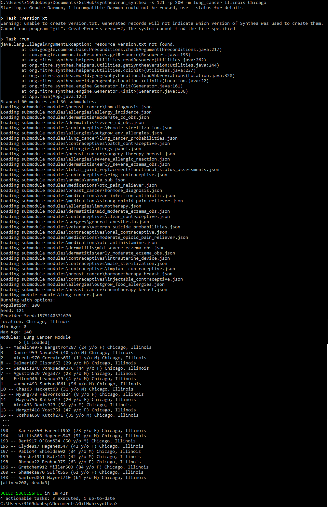

<!-- Please don't remove this: Grab your social icons from https://github.com/carlsednaoui/gitsocial -->

[0.1]: http://i.imgur.com/9I6NRUm.png (github)
[0.2]: http://i.imgur.com/wWzX9uB.png (twitter)
[0.3]: http://i.imgur.com/fep1WsG.png (facebook)

<!-- Anna's social media -->
[1.1]: https://github.com/aiuppa

<!-- Alex's social media -->
[2.1]: https://github.com/abarrington

<!-- Peter's social media -->
[3.1]: https://github.com/peterdobbs77
[3.2]: https://twitter.com/birdhouseElf77

# Forms on FHIR

Based on work started at the Society for Imaging Informatics in Medicine (SIIM) 2019 Annual Conference and Hackathon.

### Currently deployed to [FormsOnFHIR](https://peterdobbs.shinyapps.io/FormsOnFHIR/)

## Generating synthetic data (using [Synthea](https://synthetichealth.github.io/synthea/))

## SIIM Annual Conference Hackathon Team 2019

Radiologists are requesting to have the ability to enter information in a Google Forms format that can be stored as FHIR json objects, 
and we would like to create a platform that replicates this form-style functionality while still being accessible from the web. 
Shiny Apps is an R package available for download from CRAN. It makes data manipulation and analysis simple in combination with a web application.. 

### originally deployed to [FormsOnFHIR](https://formsonfhir.shinyapps.io/FormsOnFHIR/)

### Initial Authors
  * Anna Aiuppa [![github][0.1]][1.1]
  * Alexander Barrington [![github][0.1]][2.1]
  * Peter Dobbs [![github][0.1]][3.1] [![twitter][0.2]][3.2]
  